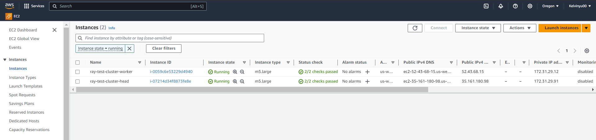
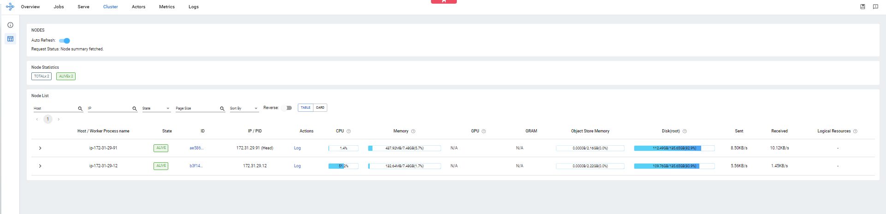
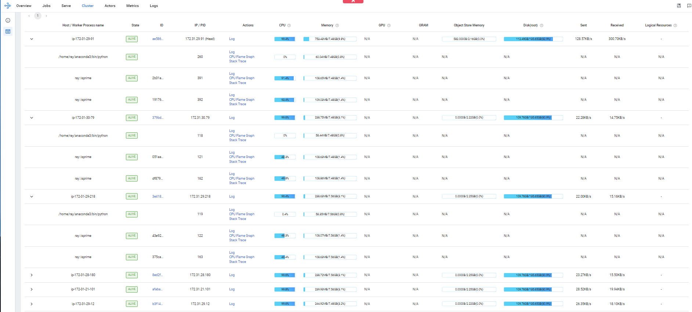
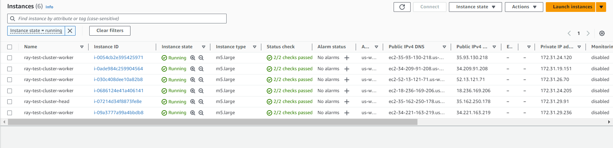
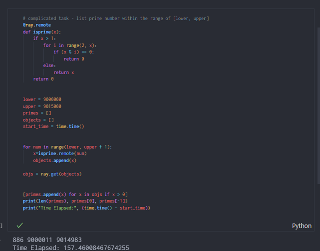
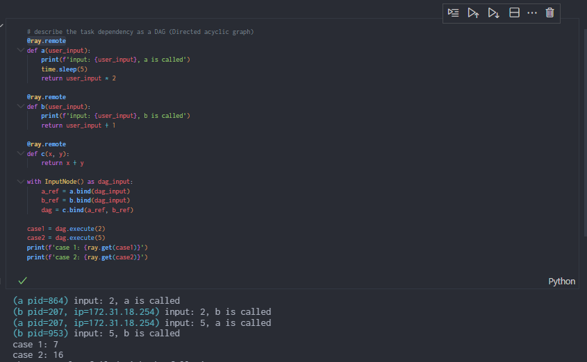
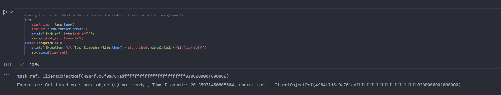
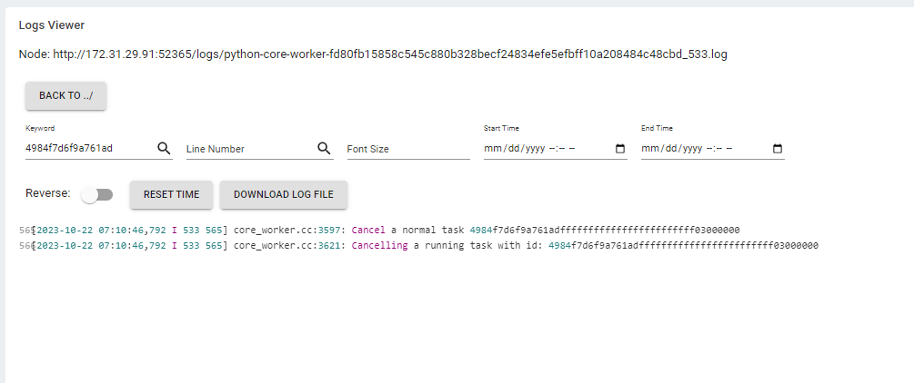
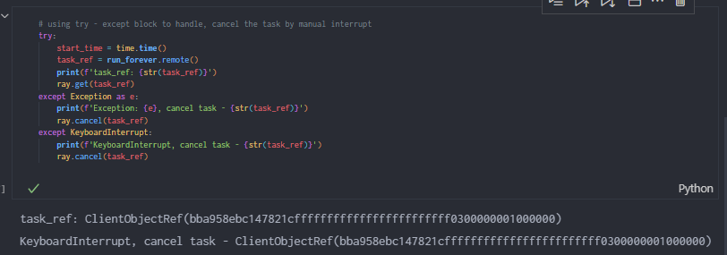
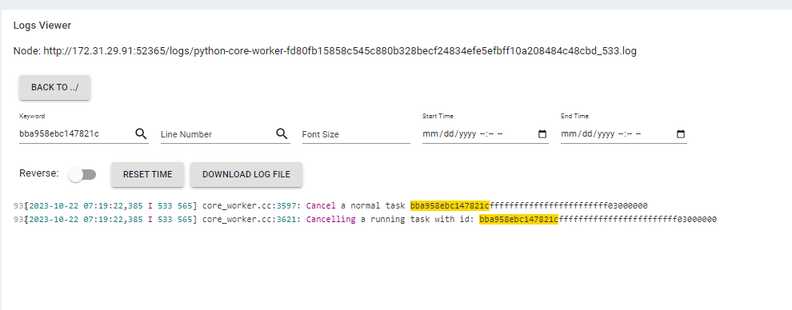

# Computational Cluster Building

In this project, I used Ray - a Python-based open source distributed computing framework, to illustrate how to build a computational cluster for data-intenstive workload.

## The rationale for choosing Ray

### High compatitble to Python/R ecosystem and Machine learning workload

It is common that the quant researcher use Python/R in their daily research. By using Ray, they just need to add a few lines of code in their existing research pipeline and their computation-intensive tasks (e.g. ML/DL model training, parameters searching, backtesting) can be submited to the cluster, and enjoy the benefit of distributed computing without diving into too many details of the low level infrastructure.

### Easy to scale horizontally and Less infrastructure management overhead

The setting of the cluster iteself is defined by one config file, which support both cloud VMs and properitery VMs. Also, it provide a autoscaler that scale the workload horizontally when current computational resources are not enough. All these features make developer life easier so that they can focus on building the applications instead of spending too much time on managing the infrastructure.

### Proven successful cases in the industry

Many large language models are developed using Ray, like ChatGPT.
https://www.anyscale.com/blog/ray-summit-2022-stories-large-language-models

## Environment
The following experiments are executed using the cloud VM on AWS, and the cluster configuration is defined in `cluster-config/ray-cluster.yaml`. The following is the basic parameters of the environment:

- Each Node has 2 core, 8GB RAM (AWS m5.large instance)
- Minimum number of worker node: 1
- Maximum number of worker including the master node: 6

All the demonstration is done by connecting the local interactive jupyter notebook to the remote cluster on AWS platform in order to simulate the daily research workflow.

## Task 1 - Basic Task Scheduling across Different Machines

For this task, a simple prime number finding program will be used to demonstrated the idea (the source code in `test/test1_list_prime.ipynb`)

We launch the cluster using the following command

```bash
ray up cluster-config/ray-cluster.yaml # the cluster name is called test-cluster
```

As a result, it will launch two instances (one head-node (master), one worker node) under AWS platform:


We can also verify it using the Ray Dashboard by the following command, it also shows that the cluster is successfully launched:
```bash
ray dashboard cluster-config/ray-cluster.yaml 
```


After the instances are launched, we can submit the task to the machine, and let Ray to scale our workload. In this task, a simple program to list out all the prime number in a given range will be used for testing.
We can see that it trigger the autoscaler in the Ray framework to scale out the workload by launching four extra worker nodes:



Verify this in AWS portal as well:



The result of the code:



## Task 2 - Task Dependiencies and Exception Handling

It is very common that there are some tasks have dependency on the other tasks. Generally, we can describe this relationship by using Direct Acyclic Graph (DAG), the Ray framework allows us to compose the task in python using the DAG API. As DAG by designed without cycle, it can guarantee acyclic from the code level.

The code and execution results are the following (source code: `test/test2_task_dependency.ipynb`):


The above code construct a DAG with three nodes (three functions), `a`, `b` and `c`, where `c` depends on the result of `a` and `b`, we can see that as `a` and `b` has no data dependency, the scheduler can freely schedule the task to either on the host machine or other machines (indicates by different ip addresses)

For exception handling, the usual exception handling mechanism in Python can be used to handle job hanging or job stucks issue. The following is an example (source code: `test/test3_stuck_job.ipynb`):

A long running task is defined as a test:
```python
# simulate stuck job or job hanging.
@ray.remote
def run_forever():
    while True:
        time.sleep(0.5)
```

To avoid the task run infinitely, timeout parameter can be used when we get back the result from the cluster. In the following example, we set the timeout to be 20 seconds which means it will rasie an exception if the job cannot be completed in 20 seconds, we can see that the exception was catched after around 20 seconds.


We can verify it by inspecting the log of the worker node, searching for the task id:



Apart from timeout, manual interruption is also feasible for canceling the tasks, and we can see that the keyboard interruption was catched.


We can also verify it by inspecting the log of the worker node, searching for the task id:


## Summary and Future Work

The above experiment demonstrated the effectiveness and feasibilty of using Ray as a backbone computing framework for quantatitive research environment.

Although the API of Ray is generally easy to use, it still requires some boilerplate code in different scenerio, for example, writing `try-except` to handle task fault-tolerent.
It may be better to have some higher level API, for example a context manager to handle the exception gracefully, so that the researcher dont need to worry about these low level details.

Morever, there are different libraries built by the Ray's official team and the community which may potentially boost the quant research efficiency. The ecosystem of Ray is worth to explore and it is possible to leverage them in the future.
