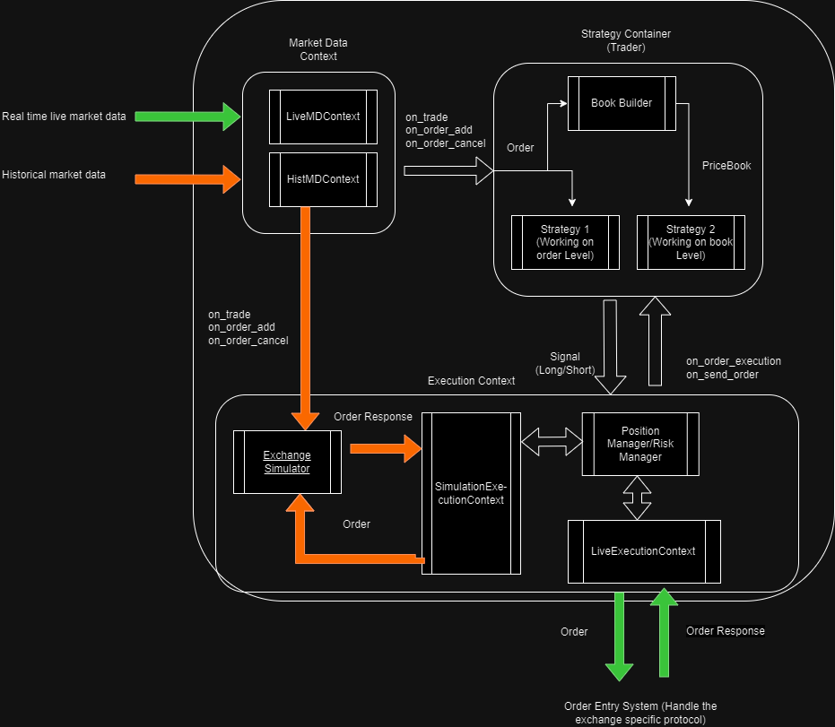

# Project 2 - Trade Simulator

In this project, a trading simulator framework is designed and implemented for backtesting strategies. In order to minimize the discrepancy of live trading and simulation, the design can be easily to be extend to accommodate live trading such that we can use the same codebase for both live trading and simulation.

## Required Environment

* Linux (Developed on Ubuntu 20.04)
* CMake 3.21
* Clang/Clang++ 16
  
## Build and execution

```bash
cmake -S . -B build
cd build
make
./trade-simulator sim
```

## Design


